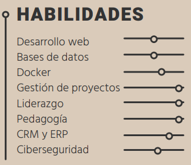

  

***<h1 align="center">CAMILA QUINTERO ROJAS</h1>*** 

***INGENIERA DE SISTEMAS Y COMPUTACIÓN***

***IBM Integration BUS Learner | Banco Popular***

 ***SOBRE MÍ***

Ingeniera de Sistemas y Computación profesional, con experiencia en la gestión de proyectos y pedagogía en el área de fundamentos matemáticos. Me considero una persona con mente innovadora y flexible. Me apasionan los temas de tecnología y la enseñanza. Tengo interés especial sobre temas relacionados con ciberseguridad, direccionamiento de proyectos, bus empresarial y arquitectura de software. Mi propuesta de valor a nivel personal y profesional está orientada a la aplicación y transmisión de los conocimientos que he adquirido en mi proceso de formación y experiencia laboral, así como una gran disposición para aprender y asumir retos importantes. Soy una persona responsable, con habilidades de liderazgo, adaptable al cambio y con un gran interés personal por el desarrollo de competencias blandas como la creatividad, la innovación y la inteligencia emocional.

 ***EXPERIENCIA LABORAL***

**MONITORA DE FUNDAMENTOS MATEMÁTICOS**

2022 | Banco Popular

* Liderar mesa de gestión de iniciativas de TI.
* Hacer seguimiento de las iniciativas, proyectos y brechas.
* Revisar los requerimientos para su gestión.

**PRÁCTICAS COMO GESTORA DE PROYECTOS**

2021 | Universidad Católica de Colombia

* Orientación de temas como: operaciones algebraicas, factorización, triángulos rectángulos y resolución de problemas matemáticos.

* Explicación de derivadas.

* Guiar proyectos relacionados a fundamentos matemáticos.

* Atención a estudiantes de primer y segundo semestre.

 ***FORMACIÓN ACADÉMICA***

**BACHILLER ACADÉMICO**

2016 | Colegio Sagrados Corazones de Madrid

**PREGRADO EN INGENIERÍA DE SISTEMAS Y COMPUTACIÓN**

2022 | Universidad Católica de Colombia

 ***ESTUDIOS COMPLEMENTARIOS***

| SENA                                                                      | IBM                                                   | UDEMY |  
| ------------------------------------------------------------------------- | ----------------------------------------------------- | ------------------------------------------------------------------ |  
| CURSO ESTRATEGIAS PEDAGÓGICAS PARA EL DESARROLLO DEL PENSAMIENTO 2021 | CURSO FUNDAMENTOS DE LA GESTIÓN DE PROYECTOS 2022 |  UNDERSTANDING CONFLUENCE FOR USERS, MANAGERS AND ADMINS 2023 |  
| CURSO ESTRATEGIAS PEDAGÓGICAS PARA EL DESARROLLO DEL PENSAMIENTO 2021 | CURSO FUNDAMENTOS DE CIBERSEGURIDAD 2022 | CURSO GIT Y GITHUB 2023                                                 |

